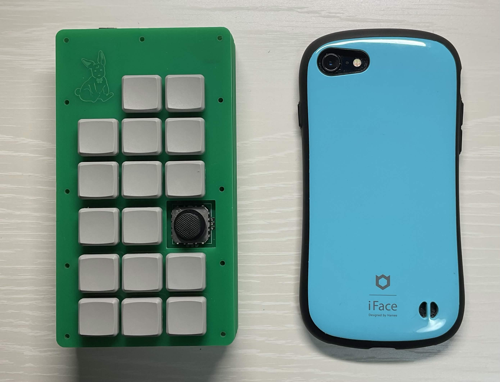

# Flicon
物理フリックを搭載した完全片手持ちキーボード

## Fliconとは
Flicon は片手での日本語入力に特化したキーボードです。一般的なキーボードのように多数のキーを並べるのではなく、物理フリック操作を取り入れることで、片手で十分に文字を入力できることを目指しました。特に、スマートフォンのフリック入力に慣れている人は、特に練習をすることなくすぐに使いこなせることができるでしょう。

名前の由来は、物理フリック（Flick）を搭載し、形状はテレビのリモコン（Temote Controler）から着想を得たため、 Flicon (= Flick + Remote Controler)と名付けました。

